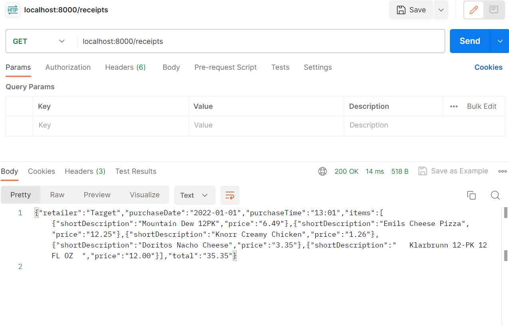
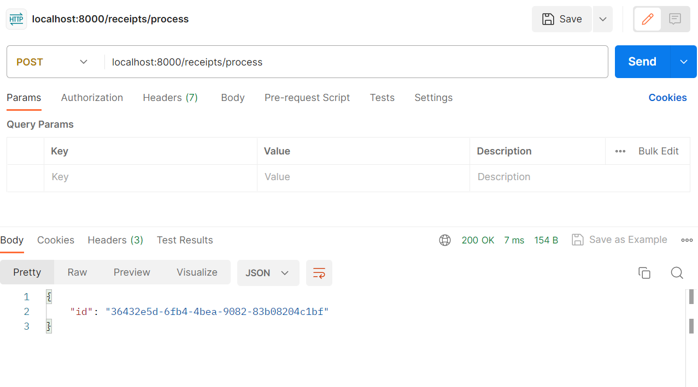
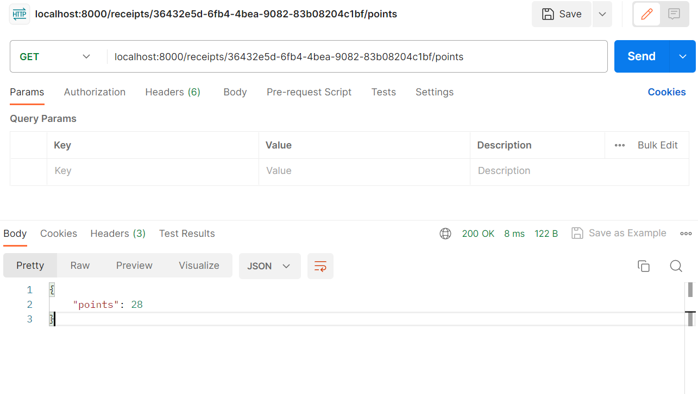

#Receipt Processor API
Test the working API with Postman

##Test URL: `http://localhost:8000`

##Endpoints

1. `/receipts`
**URL**: `http://localhost:8000/receipts`
**Mathod**: `GET`
Submit a receipt (For this project, we read the local Json file and show on the server page.) 

2. `/receipts/process`
**URL**: `http://localhost:8000/receipts/process`
**Method**: `POST`
Submit a receipt for processing and receive an ID for the receipt.

2. `/receipts/{id}/points`
**URL**: `http://localhost:8000/{id}/points`
Based on the previous screenshot, the url is `http://localhost:8000/receipts/36432e5d-6fb4-4bea-9082-83b08204c1bf/points`
**Method**: `GET`
Retrieve the number of points awarded for a specific receipt.

##Error Responses:
1. 405 Method: please check the chosen method. 
2. 404 PageNote Found: please check the endpoints and port. Id might be invaild. 
3. 400 Bad Request: possible happend on `http://localhost:8000/receipts/process`--invaild receipt

##How to run it:
Please run and checkout the following command line:
`make help`
